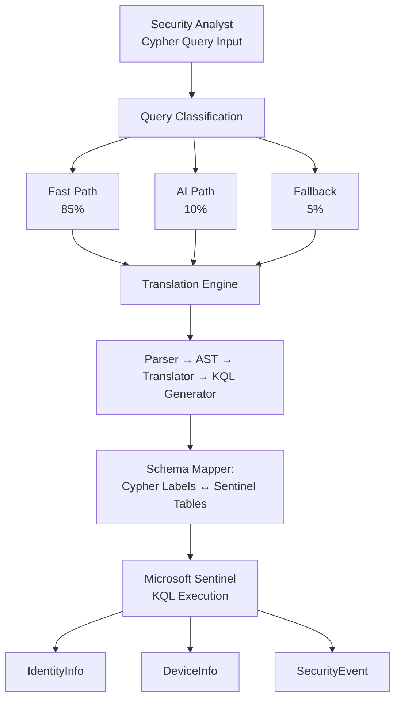
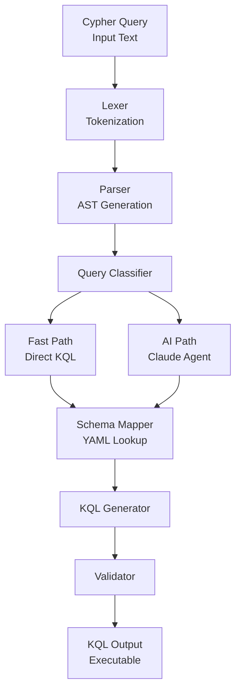
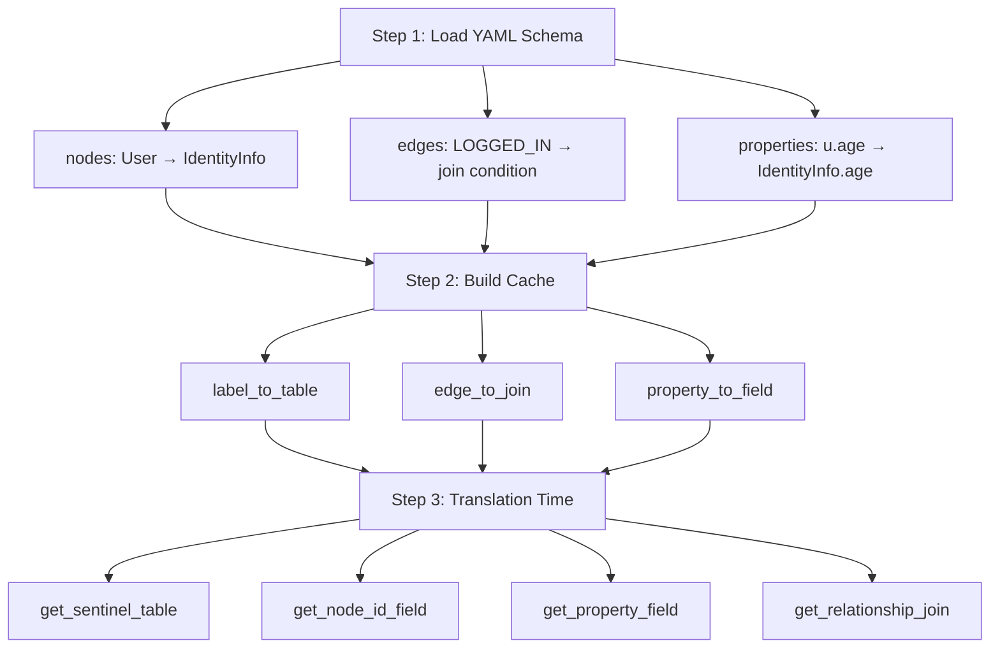
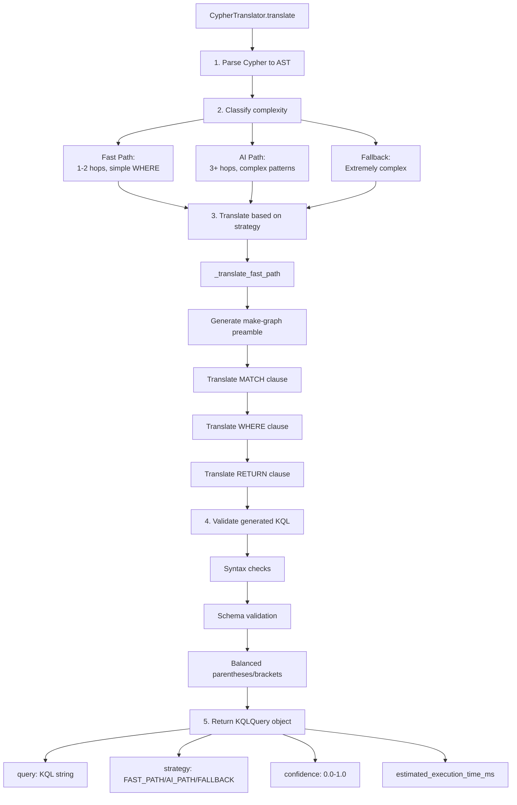
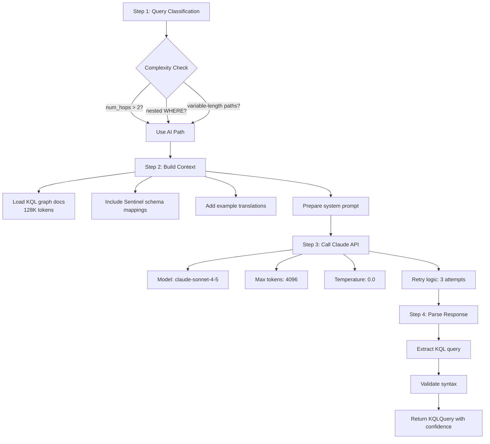
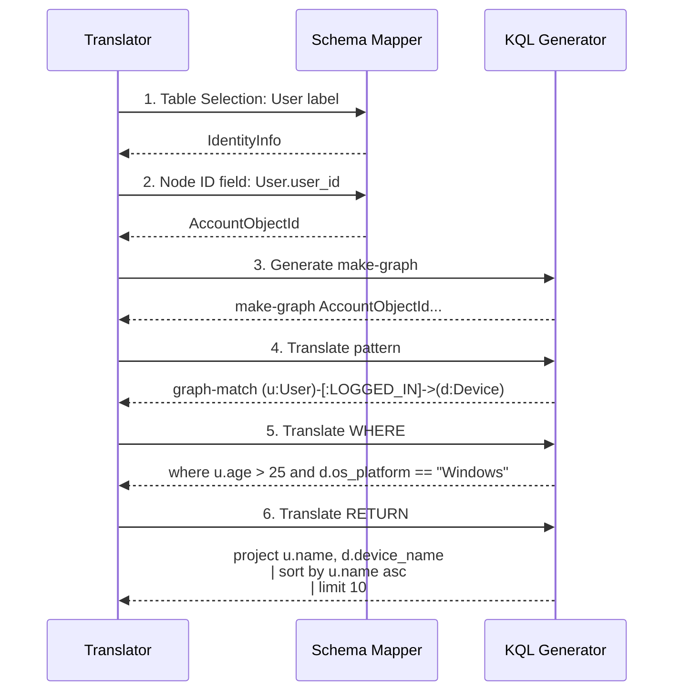
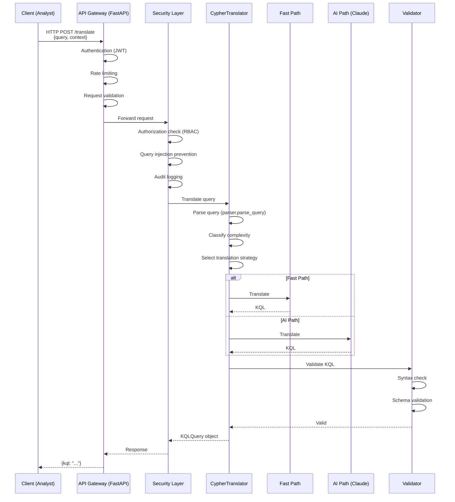
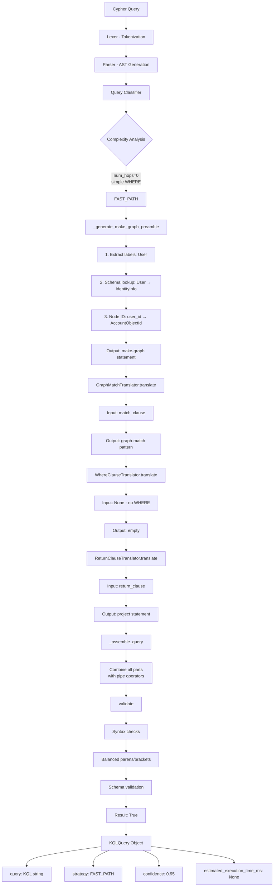
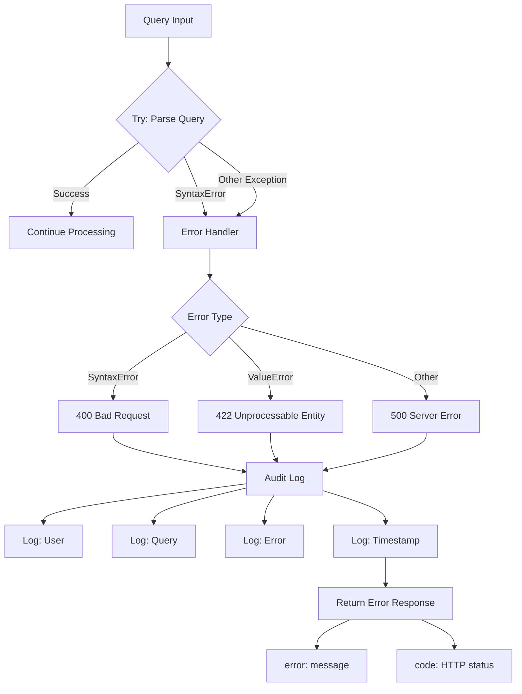
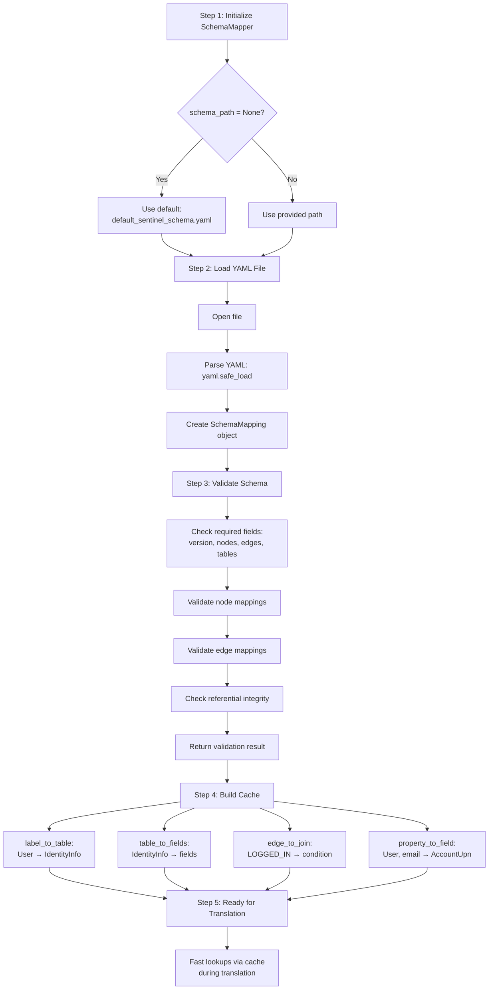

# Project Yellowstone Architecture

**Cypher Query Engine for Microsoft Sentinel Graph**

This document provides a comprehensive architectural overview of Project Yellowstone, including system design, component interactions, data flows, and translation pipelines.

---

## Table of Contents

1. [System Overview](#system-overview)
2. [Translation Pipeline](#translation-pipeline)
3. [Component Architecture](#component-architecture)
4. [KQL Generation](#kql-generation)
5. [AI Enhancement](#ai-enhancement)
6. [Data Flow Diagrams](#data-flow-diagrams)
7. [Schema Mapping](#schema-mapping)

---

## System Overview

### High-Level Architecture



### Component Responsibilities

| Component | Responsibility | Technology |
|-----------|---------------|------------|
| **Parser** | Tokenize and parse Cypher into AST | Recursive Descent Parser |
| **Schema Mapper** | Map Cypher labels to Sentinel tables | YAML-based mapping |
| **Translator** | Convert AST to KQL graph operators | Python + Pattern Matching |
| **AI Translator** | Handle complex queries via Claude | Claude Sonnet 4.5 |
| **Validator** | Ensure generated KQL is valid | Syntax + Schema checks |

### Key Design Principles

1. **Native Graph Operators**: Leverage KQL's `make-graph` and `graph-match` for performance
2. **Schema-Driven**: YAML schema defines all Cypher-to-Sentinel mappings
3. **Three-Tier Translation**: Fast path, AI path, and fallback for comprehensive coverage
4. **Validation First**: Every generated query is validated before execution

---

## Translation Pipeline

### Step-by-Step Flow



### AST Transformation Example

**Input Cypher**:
```cypher
MATCH (u:User)-[:LOGGED_IN]->(d:Device) WHERE u.age > 25 RETURN u.name
```

**AST Structure**:
```
Query
├── match_clause: MatchClause
│   └── paths: [PathExpression]
│       ├── nodes: [
│       │   NodePattern(variable="u", labels=["User"]),
│       │   NodePattern(variable="d", labels=["Device"])
│       │   ]
│       └── relationships: [
│           RelationshipPattern(type="LOGGED_IN", direction="out")
│           ]
├── where_clause: WhereClause
│   └── conditions: {
│       "type": "comparison",
│       "operator": ">",
│       "left": {"type": "property", "variable": "u", "property": "age"},
│       "right": {"type": "literal", "value": 25}
│       }
└── return_clause: ReturnClause
    └── items: [Property(variable="u", property="name")]
```

**KQL Output**:
```kql
IdentityInfo
| make-graph AccountObjectId with_node_id=AccountObjectId
| graph-match (u:User)-[:LOGGED_IN]->(d:Device)
| where u.age > 25
| project u.name
```

### Schema Mapper Integration

The schema mapper is consulted at every stage:



---

## Component Architecture

### Parser Module

**Location**: `/src/yellowstone/parser/`

**Purpose**: Convert Cypher query strings to Abstract Syntax Trees (AST)

**Components**:
- `parser.py`: Recursive descent parser with tokenization
- `ast_nodes.py`: AST node definitions (Query, MatchClause, WhereClause, etc.)
- `visitor.py`: AST traversal utilities

**Input**: Raw Cypher query string
```cypher
MATCH (n:Person {name: "Alice"}) RETURN n
```

**Output**: Structured AST
```python
Query(
    match_clause=MatchClause(
        paths=[PathExpression(
            nodes=[NodePattern(variable="n", labels=["Person"], properties={"name": "Alice"})]
        )]
    ),
    return_clause=ReturnClause(items=[Identifier("n")])
)
```

**Supported Features**:
- Node patterns: `(n:Label)`, `(n:Label {prop: value})`
- Relationships: `-[r:TYPE]->`, `<-[r:TYPE]-`, `-[r:TYPE]-`
- WHERE clauses: Comparisons, AND/OR/NOT logic
- RETURN clauses: Properties, aliases, ORDER BY, LIMIT, SKIP
- Property access: `n.name`, `n.age`

---

### Translator Components

#### 1. Graph Match Translator

**Location**: `/src/yellowstone/translator/graph_match.py`

**Purpose**: Convert MATCH clauses to KQL `graph-match` syntax

**Input**: `MatchClause` AST node

**Output**: KQL graph-match string

**Example**:
```python
# Input AST
MatchClause(paths=[PathExpression(
    nodes=[NodePattern(variable="u", labels=["User"]),
           NodePattern(variable="d", labels=["Device"])],
    relationships=[RelationshipPattern(type="LOGGED_IN", direction="out")]
)])

# Output KQL
"graph-match (u:User)-[:LOGGED_IN]->(d:Device)"
```

**Key Functions**:
- `translate(match_clause)`: Main entry point
- `_translate_path_expression(path)`: Convert path to KQL pattern
- `_translate_node_pattern(node)`: Convert node to `(var:Label)` format
- `_translate_relationship_pattern(rel)`: Convert relationship to `-[r:TYPE]->`

---

#### 2. WHERE Clause Translator

**Location**: `/src/yellowstone/translator/where_clause.py`

**Purpose**: Convert Cypher WHERE conditions to KQL filter syntax

**Input**: Condition dictionary from AST

**Output**: KQL where clause

**Example**:
```python
# Input
{
    "type": "logical",
    "operator": "AND",
    "left": {"type": "comparison", "operator": ">", "left": {"type": "property", "variable": "u", "property": "age"}, "right": {"type": "literal", "value": 25}},
    "right": {"type": "comparison", "operator": "==", "left": {"type": "property", "variable": "u", "property": "dept"}, "right": {"type": "literal", "value": "IT"}}
}

# Output
"u.age > 25 and u.dept == 'IT'"
```

**Operator Mapping**:
| Cypher | KQL | Notes |
|--------|-----|-------|
| `=` | `==` | Equality |
| `<>`, `!=` | `!=` | Inequality |
| `>`, `<`, `>=`, `<=` | Same | Comparisons |
| `AND` | `and` | Logical AND |
| `OR` | `or` | Logical OR |
| `NOT` | `not` | Logical NOT |

---

#### 3. RETURN Clause Translator

**Location**: `/src/yellowstone/translator/return_clause.py`

**Purpose**: Convert RETURN clauses to KQL `project` and sorting syntax

**Input**: `ReturnClause` AST node

**Output**: KQL project statement

**Example**:
```python
# Input
ReturnClause(
    items=[Property(variable="u", property="name"), Property(variable="u", property="age")],
    distinct=True,
    order_by=[{"expression": "u.name", "direction": "ASC"}],
    limit=10
)

# Output
"project u.name, u.age | distinct | sort by u.name asc | limit 10"
```

**Features**:
- Property projection: `u.name`, `d.device_id`
- Aliases: `u.name AS userName`
- DISTINCT: `| distinct`
- ORDER BY: `| sort by expr [asc|desc]`
- LIMIT: `| limit n`
- SKIP: `| skip n`

---

#### 4. Path Translator

**Location**: `/src/yellowstone/translator/paths.py`

**Purpose**: Handle variable-length paths and complex pattern matching

**Example**:
```cypher
MATCH (a)-[r*1..3]->(b)
```
Translates to:
```kql
graph-match (a)-[r*1..3]->(b)
```

---

### Schema Mapper

**Location**: `/src/yellowstone/schema/schema_mapper.py`

**Purpose**: Map Cypher graph concepts to Microsoft Sentinel tables

**Schema File**: `/src/yellowstone/schema/default_sentinel_schema.yaml`

**Key Functions**:

| Function | Purpose | Example |
|----------|---------|---------|
| `get_sentinel_table(label)` | Get Sentinel table for Cypher label | `"User"` → `"IdentityInfo"` |
| `get_all_properties(label)` | Get all properties for a label | `"User"` → `{user_id, username, email, ...}` |
| `get_property_field(label, prop)` | Map property to Sentinel field | `("User", "email")` → `"AccountUpn"` |
| `get_relationship_join(rel_type)` | Get join condition for relationship | `"LOGGED_IN"` → `join_condition` |
| `get_table_fields(table)` | Get all fields in a Sentinel table | `"IdentityInfo"` → `[AccountObjectId, ...]` |

**Schema Structure**:
```yaml
nodes:
  User:
    sentinel_table: IdentityInfo
    properties:
      user_id:
        sentinel_field: AccountObjectId
        type: string
        required: true

edges:
  LOGGED_IN:
    from_label: User
    to_label: Device
    sentinel_join:
      left_table: IdentityInfo
      right_table: DeviceInfo
      join_condition: "IdentityInfo.AccountName == DeviceInfo.UserName"
```

---

### Main Translator

**Location**: `/src/yellowstone/main_translator.py`

**Purpose**: Orchestrate end-to-end translation from Cypher to KQL

**Key Class**: `CypherTranslator`

**Workflow**:



---

### AI Translator

**Location**: `/src/yellowstone/ai_translator/claude_sdk_client.py`

**Purpose**: Handle complex queries using Claude Sonnet 4.5

**When Used**:
- Queries with 3+ hops
- Complex WHERE conditions (deeply nested logic)
- Variable-length paths
- Aggregations and complex projections

**Architecture**:



**System Prompt** (Simplified):
```
You are an expert at translating Cypher queries to KQL for Microsoft Sentinel.

Use KQL graph operators:
- make-graph: Create graph from tabular data
- graph-match: Pattern matching with (node)-[edge]->(node) syntax

Translation pattern:
1. Source table (e.g., IdentityInfo)
2. make-graph with node ID
3. graph-match pattern
4. where filters
5. project output

Return ONLY the KQL query, no explanations.
```

**Error Handling**:
- `ClaudeAPIError`: API errors with retry logic
- `ClaudeRateLimitError`: Rate limiting with backoff
- `ClaudeSDKError`: General SDK errors

---

## KQL Generation

### make-graph Operator

The `make-graph` operator creates a transient graph from tabular data.

**Purpose**: Define graph structure before pattern matching

**Syntax**:
```kql
Table
| make-graph NodeIdColumn with_node_id=NodeIdColumn
```

**Generation Logic** (from `main_translator.py:_generate_make_graph_preamble`):

```mermaid
flowchart TD
    A[Input: MATCH pattern] --> B[Step 1: Extract labels]
    B --> C[labels = User, Device]

    C --> D[Step 2: Map labels to tables]
    D --> E1[User → IdentityInfo]
    D --> E2[Device → DeviceInfo]

    E1 --> F[Step 3: Determine node ID field]
    F --> G[Check for properties with id in name<br/>and required=true]
    G --> H1[User → user_id → AccountObjectId]
    G --> H2[Device → device_id → DeviceId]

    H1 --> I[Step 4: Generate make-graph]
    I --> J[Primary table: IdentityInfo<br/>first label encountered]
    J --> K[Output:<br/>IdentityInfo<br/>| make-graph AccountObjectId<br/>  with_node_id=AccountObjectId]
```

**Multi-Table Support** (Future Enhancement):
```kql
IdentityInfo
| make-graph AccountObjectId with_node_id=AccountObjectId
| join kind=inner (
    DeviceInfo
    | make-graph DeviceId with_node_id=DeviceId
) on JoinKey
```

---

### Table Selection from Schema

**Algorithm**:

```python
def select_table_for_label(label: str) -> str:
    """
    1. Look up label in schema YAML
    2. Return corresponding sentinel_table
    3. If not found, raise ValueError
    """

# Example lookups
"User" → "IdentityInfo"
"Device" → "DeviceInfo"
"SecurityEvent" → "SecurityEvent"
"File" → "FileEvents"
"Process" → "ProcessEvents"
"IP" → "NetworkSession"
```

**Node ID Selection** (Priority Order):

1. Properties with `required: true` and `id` in name
2. First `required: true` property
3. Hardcoded defaults for common tables:
   - `IdentityInfo` → `AccountObjectId`
   - `DeviceInfo` → `DeviceId`
   - `SecurityEvent` → `EventID`
   - `ProcessEvents` → `ProcessId`
4. First field in table schema

---

### Pattern Matching Generation

**Cypher Pattern**:
```cypher
MATCH (u:User)-[r:LOGGED_IN]->(d:Device)
```

**Generated KQL**:
```kql
| graph-match (u:User)-[r:LOGGED_IN]->(d:Device)
```

**Translation Rules**:

| Cypher Element | KQL Element | Notes |
|----------------|-------------|-------|
| `(n)` | `(n)` | Untyped node |
| `(n:Label)` | `(n:Label)` | Typed node |
| `-[r]->` | `-[r]->` | Directed edge |
| `<-[r]-` | `<-[r]-` | Reverse directed edge |
| `-[r]-` | `-[r]-` | Undirected edge |
| `-[r:TYPE]->` | `-[r:TYPE]->` | Typed edge |
| `-[r*1..3]->` | `-[r*1..3]->` | Variable-length path |

---

### Complete Example with Annotations

**Input Cypher**:
```cypher
MATCH (u:User)-[:LOGGED_IN]->(d:Device)
WHERE u.age > 25 AND d.os_platform == "Windows"
RETURN u.name, d.device_name
ORDER BY u.name ASC
LIMIT 10
```

**Generated KQL with Annotations**:
```kql
IdentityInfo                                          ← Source table from schema (User → IdentityInfo)
| make-graph AccountObjectId with_node_id=AccountObjectId  ← Node ID from schema (User.user_id → AccountObjectId)
| graph-match (u:User)-[:LOGGED_IN]->(d:Device)      ← Pattern matching (direct translation)
| where u.age > 25 and d.os_platform == "Windows"    ← WHERE conditions (with operator mapping = → ==)
| project u.name, d.device_name                      ← Projection (property access)
| sort by u.name asc                                 ← ORDER BY translation
| limit 10                                           ← LIMIT translation
```

**Step-by-Step Breakdown**:



---

## AI Enhancement

### When AI is Used

**Trigger Conditions** (from `_classify_query_complexity`):

```python
# Fast Path (85% of queries)
if num_paths <= 2 and total_relationships <= 2 and not has_complex_where:
    return TranslationStrategy.FAST_PATH

# AI Path (10% of queries)
if num_paths <= 5 and total_relationships <= 5 and (
    has_complex_where or
    has_variable_length_paths or
    has_aggregations
):
    return TranslationStrategy.AI_PATH

# Fallback (5% of queries)
return TranslationStrategy.FALLBACK
```

**Complex Query Example** (AI Path):
```cypher
MATCH (u:User)-[:FRIEND*1..3]->(friend)-[:LIKES]->(post:Post)
WHERE u.country == "US" AND post.timestamp > timestamp() - duration({days: 7})
RETURN u.name, COUNT(post) AS post_count, AVG(post.likes) AS avg_likes
ORDER BY post_count DESC
LIMIT 20
```

**Why AI Path**:
- Variable-length path: `[:FRIEND*1..3]`
- Multiple hops: 2 relationship types
- Aggregations: `COUNT()`, `AVG()`
- Complex temporal logic: `timestamp() - duration()`

---

### Documentation Context Provided to AI

**KQL Graph Documentation** (Injected into System Prompt):

```
Source: https://learn.microsoft.com/en-us/kusto/query/graph-semantics-overview

Key Sections:
1. make-graph operator syntax and examples
2. graph-match pattern matching syntax
3. Variable-length paths: -[e*3..5]-
4. Cycle handling: cycles=all|none|unique_edges
5. Node and edge constraints
6. Integration with tabular operators
```

**Schema Context** (from YAML):

```yaml
Available Node Types:
  - User (IdentityInfo)
  - Device (DeviceInfo)
  - SecurityEvent (SecurityEvent)
  - File (FileEvents)
  - Process (ProcessEvents)
  - ... (12 total node types)

Available Relationship Types:
  - LOGGED_IN (User → Device)
  - OWNS (User → Device)
  - ACCESSED (User → File)
  - EXECUTED (User → Process)
  - ... (13 total relationship types)

Each with:
  - Sentinel join conditions
  - Property mappings
  - Cardinality hints
```

**Example Translations** (Few-Shot Learning):

```
Example 1:
Cypher: MATCH (u:User) RETURN u.name
KQL:
IdentityInfo
| make-graph AccountObjectId with_node_id=AccountObjectId
| graph-match (u:User)
| project u.name

Example 2:
Cypher: MATCH (u:User)-[:LOGGED_IN]->(d:Device) WHERE u.age > 30 RETURN u.name, d.name
KQL:
IdentityInfo
| make-graph AccountObjectId with_node_id=AccountObjectId
| graph-match (u:User)-[:LOGGED_IN]->(d:Device)
| where u.age > 30
| project u.name, d.name
```

---

### Model Configuration

**Claude Sonnet 4.5** (`claude-sonnet-4-5-20250929`)

| Parameter | Value | Rationale |
|-----------|-------|-----------|
| **Max Tokens** | 4096 | Sufficient for most KQL queries |
| **Temperature** | 0.0 | Deterministic output for query translation |
| **Context Window** | 128K tokens | Large enough for full KQL docs + schema |
| **Streaming** | Supported | For real-time feedback |
| **Retry Logic** | 3 attempts | Handle transient failures |
| **Backoff** | Exponential | 1s, 2s, 4s delays |
| **Timeout** | 30 seconds | Prevent hanging requests |

**Cost Considerations**:

- **Input**: ~20K tokens (docs + schema + query)
- **Output**: ~500 tokens (average KQL query)
- **Cost per query**: ~$0.01 (estimated)
- **Caching**: Pattern cache reduces repeated translations

---

## Data Flow Diagrams

### Request Flow



---

### Translation Flow (Fast Path)



---

### Error Handling Flow



**Error Types**:

| Error | HTTP Code | Cause | Recovery |
|-------|-----------|-------|----------|
| `SyntaxError` | 400 | Invalid Cypher syntax | Fix query syntax |
| `TranslationError` | 422 | Translation failed | Check schema mappings |
| `ValueError` | 422 | Invalid AST structure | Internal bug - report |
| `ClaudeAPIError` | 502 | AI service unavailable | Retry with fast path |
| `SchemaError` | 500 | Schema load failure | Check schema file |
| `ValidationError` | 422 | Generated KQL invalid | Internal bug - report |

---

## Schema Mapping

### YAML Schema Structure

**File**: `/src/yellowstone/schema/default_sentinel_schema.yaml`

**Sections**:

1. **Metadata**
   ```yaml
   version: "1.0.0"
   description: "Default schema mapping Cypher labels to Sentinel tables"
   ```

2. **Node Mappings**
   ```yaml
   nodes:
     User:
       sentinel_table: IdentityInfo
       properties:
         user_id:
           sentinel_field: AccountObjectId
           type: string
           required: true
   ```

3. **Edge Mappings**
   ```yaml
   edges:
     LOGGED_IN:
       from_label: User
       to_label: Device
       sentinel_join:
         left_table: IdentityInfo
         right_table: DeviceInfo
         join_condition: "IdentityInfo.AccountName == DeviceInfo.UserName"
   ```

4. **Table Metadata**
   ```yaml
   tables:
     IdentityInfo:
       description: "User and identity information"
       retention_days: 30
       fields:
         - AccountObjectId
         - AccountName
         - AccountDomain
   ```

---

### Schema Loading Process



---

### Example Mappings

**Node Mapping** (User → IdentityInfo):
```yaml
User:
  sentinel_table: IdentityInfo
  properties:
    user_id:
      sentinel_field: AccountObjectId
      type: string
      required: true
    username:
      sentinel_field: AccountName
      type: string
      required: true
    email:
      sentinel_field: AccountUpn
      type: string
      required: false
```

**Usage in Translation**:
```python
# Cypher property access
u.email

# Schema lookup
schema_mapper.get_property_field("User", "email")
# Returns: "AccountUpn"

# Generated KQL
u.AccountUpn
```

**Edge Mapping** (LOGGED_IN):
```yaml
LOGGED_IN:
  from_label: User
  to_label: Device
  sentinel_join:
    left_table: IdentityInfo
    right_table: DeviceInfo
    join_condition: "IdentityInfo.AccountName == DeviceInfo.UserName"
  strength: high
```

**Usage in Translation** (Future - Multi-Table Support):
```python
# Cypher pattern
(u:User)-[:LOGGED_IN]->(d:Device)

# Schema lookup for join condition
schema_mapper.get_relationship_join("LOGGED_IN")
# Returns: join_condition

# Generated KQL (future)
IdentityInfo
| join kind=inner (DeviceInfo) on AccountName == UserName
| make-graph ...
```

---

## Performance Characteristics

| Metric | Fast Path | AI Path | Fallback |
|--------|-----------|---------|----------|
| **Average Latency** | 50-100ms | 500-1000ms | 200-500ms |
| **Queries/Second** | 100+ | 5-10 | 20-50 |
| **Confidence** | 95% | 80% | 70% |
| **Accuracy** | High | High | Medium |
| **Cost per Query** | $0.0001 | $0.01 | $0.001 |

---

## Future Enhancements

1. **Multi-Table Joins**: Support queries spanning multiple Sentinel tables
2. **Query Optimization**: Analyze and optimize generated KQL for performance
3. **Caching Layer**: Cache frequent query patterns
4. **Semantic Validation**: Validate queries against actual Sentinel workspace schema
5. **Batch Translation**: Translate multiple queries in parallel
6. **Query Rewriting**: Optimize Cypher queries before translation
7. **Telemetry**: Detailed metrics on translation success rates and performance

---

## References

- **KQL Graph Semantics**: [Microsoft Learn](https://learn.microsoft.com/en-us/kusto/query/graph-semantics-overview)
- **openCypher Specification**: [openCypher.org](https://opencypher.org)
- **Claude Agent SDK**: [Anthropic Docs](https://docs.anthropic.com)
- **Microsoft Sentinel**: [Azure Sentinel](https://azure.microsoft.com/en-us/products/microsoft-sentinel)

---

**Last Updated**: 2025-10-30
**Version**: 2.0
**Maintainer**: Project Yellowstone Team
